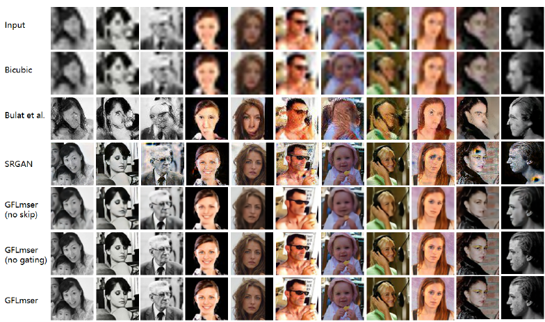

# FGLmser
This is an implementation of 'GAN Flexible Lmser for Super-resolution'  https://dl.acm.org/doi/abs/10.1145/3343031.3350952

Existing single image super-resolution (SISR) methods usually focus on Low-Resolution (LR) images which are artificially generated from High-Resolution (HR) images by a down-sampling process, but are not robust for unmatched training set and testing set. This paper proposes a GAN Flexible Lmser (GFLmser) network that bidirectionally learns the High-to-Low (H2L) process that degrades HR images to LR images and the Low-to-High (L2H) process that recovers the LR images back to HR images. The two directions share the same architecture, added with the gated skip connections from the H2L-net to the L2H-net in order to enhance information transferring for super-resolution. In comparison with several related state-of-the-art methods, experiments demonstrate that not only GFLmser is the most robust method on images of unmatched training set and testing set, but also its performance on real-world face LR images is best in PSNR and reasonably good in FID.
For FID testing, please infer https://github.com/mseitzer/pytorch-fid to do your FID test.
You can download dataset files from here: https://jbox.sjtu.edu.cn/l/xncuTr, passwd:ddti

### Datasets
We randomly choose 182, 866 face images from five datasets, including 60, 000 images from CelebA , the whole AFLW dataset , parts of LS3D-W  and 91, 310 images from VGGFace2; Then, we randomly select 3, 000 images from 53, 254 Widerface for testing and the rest for Discriminator training dataset. DIV2K dataset as training set to test model robustness, details can be seen in Sec. 4.4.
Evaluation metrics. The HR results are evaluated with Peak Signal-to-Noise Ratio (PSNR) and Frechet Inception Distance (FID). The computation of PSNR requires paired HR and LR images, and we compute PSNR based on LS3D-W subset and BSDS100 dataset. We use FID to measure similarity between HR result and the real-world high-resolution images.



 Consistent with the PSNR values in Table 1, the GFLmser appears to have the best quality, and removing skip connections deteriorates GFLmser to have more blurred details. The SRGAN tends to add color details to
the white region in black-white images, a typical example shown in the 3-rd column of the row by SRGAN, and the appearance of the SRGAN results are not so smooth as the ones by GFLmser. The results of Bulat et al.’s methods tend to reconstruct distorted faces when the face outlines are so blurred that the face region is connected to other regions. Such typical examples can be seen from the 4-th column, where the neck is mistaken as a part of face. Among all the methods, Bicubic is the worst, and it barely improves
the original LR images, perhaps because the bicubic interpolation is not suitable for real LR face images.

### requirement
```
python 3.6
torch 1.6.0
torchvision 0.7.0 
cudatoolkit 9.2
```

### train
For training the model, you need to run:
```
python v1_main.py
```

### test
Evaluation metrics. The HR results are evaluated with Peak Signal-to-Noise Ratio (PSNR) and Frechet Inception Distance (FID). The computation of PSNR requires paired HR and LR images, and we compute PSNR based on LS3D-W subset and BSDS100 dataset. We use FID to measure similarity between HR result and the real-world high-resolution images.
For testing the model, you need to run:

```
python v1_eval.py
```


### citation

```
@inproceedings{2019GAN,
  title={GAN Flexible Lmser for Super-resolution},
  author={ Li, Peiying  and  Tu, Shikui  and  Xu, Lei },
  booktitle={the 27th ACM International Conference},
  year={2019},
}
```
